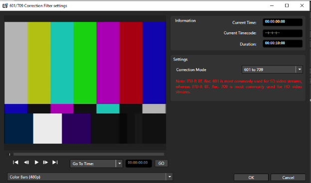
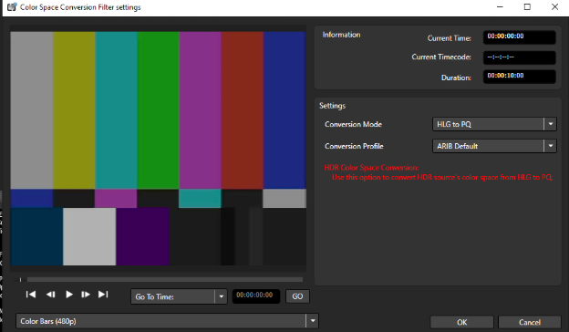
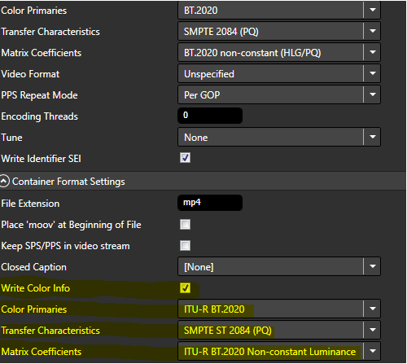

# Cambria FTC Color Space Conversion

## Table of Contents

1. [Preface](#preface)
2. [HDR Standards](#hdr-standards)
3. [Handling Wide Color Gamut](#handling-wide-color-gamut)
4. [FTC Handling of Color Related Metadata](#handling-color-related-metadata)
5. [Case Study 1: SD/HD conversions (BT.601/BT.709)](#case-study-1-sdhd-conversions-bt601bt709)
6. [Case Study 2: HDR conversions (HLG/PQ)](#case-study-2-hdr-conversions-hlgpq)
7. [Case Study 3: SDR to HDR conversions (BT.709 to HLG/PQ)](#case-study-3-sdr-to-hdr-conversions-bt709-to-hlgpq)
8. [Case Study 4: HDR to SDR conversions (PQ/HLG to BT.709)](#case-study-4-hdr-to-sdr-conversions-pqhlg-to-bt709)
9. [Special Handling of MP4 Muxer](#special-handling-of-mp4-muxer)
10. [Special Handling of X265 Encoder](#special-handling-of-x265-encoder)

## Preface

Color Space conversion is always an important part of any transcoding process. Legacy workflows of SD/HD conversions, include **BT.601** and **BT.709**, which are often converted back and forth. In modern **SDR/HDR** workflows, we often need to convert between **BT.709** and various **HDR color spaces**, namely **PQ, HLG**, etc.

Cambria File Convert supports these conversions during the transcoding process, using various available **source/target filters**.

## HDR Standards

Before converting color spaces between HDR formats, it is important to understand the different HDR standards. HDR implies a larger range of **minimum and maximum luminance** (brightness) and **wide color gamut**. Cambria FTC supports conversion between the following HDR standards:

- **PQ:** SMPTE BT.2084/BT.2100, also known as **HDR10/HDR10+**
- **HLG:** ARIB STD-B67, or SMPTE BT.2100
- **Dolby Vision** (via Dolby Vision license, see separate document)

## Handling Wide Color Gamut

There is no special conversion needed. If your target is **HLG/PQ** via the **Color Space Conversion** filter, **BT.2020** color space will be used implicitly.

You may want to use a format that retains color precision:
- **10/12-bit bit depth**
- **4:2:2 / 4:4:4 Color Format** (4:4:4 can be via **MOV ProRes**)

If you are just interested in converting from SD/HD in BT.709 to UHD/4K in BT.2020 color space, you can use “Case Study 2” below, and select BT.709 to BT.2020. This is a rare workflow though.

## Handling Color Related Metadata

Converting between **SDR and HDR** involves multiple steps:

1. Apply **Color Space Conversion Filter** (or related filter).
2. Set proper **Color Primaries, Transfer Characteristics, and Matrix Coefficients** in **Video Settings** (except for X265, which requires command-line options).
3. Enable **"Write Color Info"** in **Container Format Settings** (MP4 only).

> During SDR/HDR conversions, only colors, luminance, and mappings are performed as necessary. There is no detection nor injection of additional static/dynamic metadata, such as HDR10/HDR10+. If you are converting to X265, you can add static metadata via Extra Options as command lines. 

[X265 CLI Documentation](https://x265.readthedocs.io/en/default/cli.html#vui-video-usability-information-options)

## Case Study 1: SD/HD Conversions (BT.601/BT.709)

1. In **Preset Editor**, add the **601/709 Correction** video filter.

   
   
   
   
   

2. The filter can be applied as a **source or target filter**, but applying it as a **source filter** is more efficient.
3. In **Video Settings** (Encoding Tab), select **Color Primaries, Transfer Coefficients, and Matrix Coefficients**.


> **Note:** This conversion **has loss** and is **not perfectly reversible**.

## Case Study 2: HDR Conversions (HLG/PQ)

This case is about converting between HLG and PQ. This conversion is reversible. Unlike Case Study 1, we select Color Space Conversion Filter:





The filter can be added as a source or target filter. However, this is more efficient and accurate as a source filter.


Then, select proper Color Primaries, Transfer Coefficients and Matrix Coefficients in Video Settings in the Encoding Tab of the Preset Editor Window:


## Case Study 3: SDR to HDR Conversions (BT.709 to HLG/PQ)

This is similar to Case Study 2 in setup, just choose “BT.709 to HLG” in “Conversion Mode”. If you want to convert BT.709 to PQ, you can add an additional Color Space Conversion filter, and convert HLG to PQ.

Similarly, you also need to select proper Color Primaries, Transfer Coefficients and Matrix Coefficients in Video Settings in the Encoding Tab of the Preset Editor Window:

## Case Study 4: HDR to SDR Conversions (PQ/HLG to BT.709)

While this is also similar to Case Study 2 and 3 in setup, as well as selecting proper Color Primaries, Transfer Coefficients and Matrix Coefficients in Video Settings, this is a highly controversial case.

First of all, as you can foresee, there are lots of data loss in such conversion, because, PQ/HLG (BT.2020 color space) is much larger than BT.709, and to achieve satisfactory conversion results, tone mapping algorithm is also used.

Currently, FTC is using a modified version of the Hable algorithm and is very conservative in nature. We are investigating to expose more options for users to fine tune the parameters, as well as using other well known algorithms, such as Reinhard.


> **Note:** Future versions may allow users to fine-tune **Reinhard or other tone mapping algorithms**.

## Special Handling of MP4 Muxer

BBy default, the color information that was set in Video Settings will be applied to the container as well, and there is no separate color information setting in Container Format Settings section. 


The only exception is MP4 Muxer. To retain maximum compatibility with hardware players with our MP4 outputs, FTC does not write color information metadata by default (as well as not writing other metadata, but not described in this document). Hence, if your output is MP4 and when your players have no such issue, you should also write color information to the container as well (the example is PQ):



   

## Special Handling of X265 Encoder

The **X265 encoder** has numerous settings configured via **Extra Options**, including **color information**.

Example settings for **PQ encoding**:

   
   
   
   
   

For **HDR10 encoding**, configure **MaxCLL and MaxFALL** via:

```
--max-cll <value>
```

> **Note:** FTC does **not** measure or relay these values from the source. Users must manually input them.
